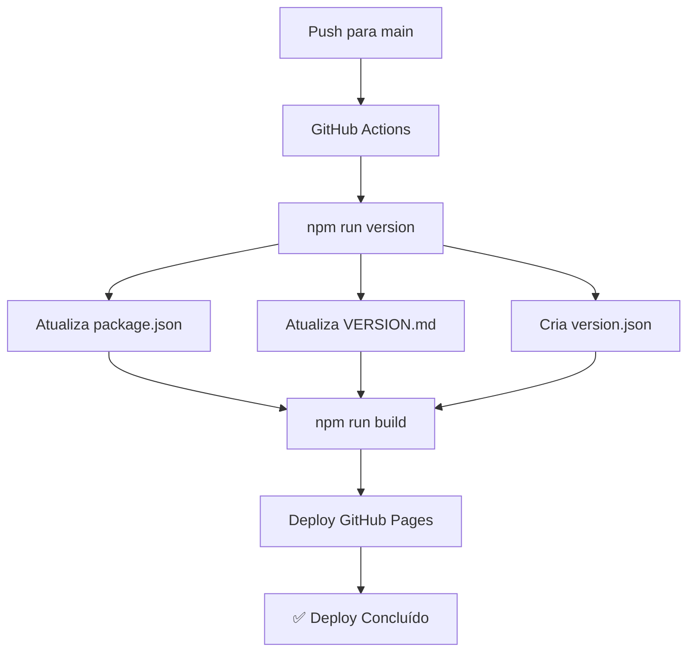

# 📋 Sistema de Versioning Automático - Portfolio

## 🎯 Visão Geral

Este projeto implementa um sistema de versioning automático que captura o número de push na branch main e atualiza a versão automaticamente a cada deploy.

## 🚀 Como Funciona

### 1. **Captura de Commits**
- O script `scripts/version.js` conta o número total de commits na branch main
- Gera uma versão no formato `1.{commitCount}.0`

### 2. **Atualização Automática**
- **package.json**: Atualiza a versão
- **VERSION.md**: Adiciona entrada no changelog
- **src/version.json**: Cria arquivo com informações da build

### 3. **Deploy Automático**
- **predeploy**: Executa `npm run version` + `npm run build`
- **deploy**: Publica no GitHub Pages
- **postdeploy**: Confirma o deploy

## 📦 Estrutura de Arquivos

```
portfolio/
├── scripts/
│   ├── version.js          # Script principal de versioning
│   └── README.md           # Documentação dos scripts
├── .github/
│   └── workflows/
│       └── deploy.yml      # GitHub Actions (opcional)
├── src/
│   ├── components/
│   │   └── VersionComponent.js  # Componente para exibir versão
│   ├── styles/
│   │   └── components/
│   │       └── version.css      # Estilos do componente
│   └── version.json        # Arquivo gerado automaticamente
├── VERSION.md              # Histórico de versões
├── VERSIONING.md           # Esta documentação
└── package.json            # Configuração do projeto
```

## 🔧 Scripts Disponíveis

### `npm run version`
Executa o script de versioning manualmente.

### `npm run deploy`
Executa o processo completo:
1. Atualiza versão
2. Gera build
3. Deploy no GitHub Pages

### `npm run predeploy`
Executado automaticamente antes do deploy:
1. Atualiza versão
2. Gera build

## 📊 Exemplo de Uso

```bash
# Deploy manual
npm run deploy

# Apenas versioning
npm run version

# Build local
npm run build
```

## 🎨 Componente de Versão

O `VersionComponent` exibe no footer:
- **Versão**: v1.6.0
- **Build**: #6
- **Data**: 19/12/2024

## 📈 Histórico de Versões

### v1.6.0 - 2024-12-19
- Sistema de versioning automático implementado
- Componente de versão adicionado
- Scripts de deploy configurados
- GitHub Actions configurado

## 🔄 Fluxo de Deploy



## 🛠️ Configuração Avançada

### Personalizar Formato de Versão
Edite `scripts/version.js`:
```javascript
// Formato atual: 1.{commitCount}.0
const newVersion = `1.${commitCount}.0`;

// Formato personalizado: {commitCount}.0.0
const newVersion = `${commitCount}.0.0`;
```

### Adicionar Informações Extras
Edite `scripts/version.js` na função `createVersionInfo`:
```javascript
const versionInfo = {
  version: version,
  commitCount: commitCount,
  buildDate: new Date().toISOString(),
  buildNumber: commitCount,
  environment: process.env.NODE_ENV || 'development',
  // Adicione campos personalizados
  branch: 'main',
  author: 'Cleverson Pedroso'
};
```

## 🐛 Troubleshooting

### Erro: "git rev-list --count HEAD"
- Verifique se está em um repositório Git
- Execute `git init` se necessário

### Versão não atualiza
- Verifique permissões de escrita
- Execute `npm run version` manualmente

### Deploy falha
- Verifique se o GitHub Pages está configurado
- Verifique se o token de acesso está correto

## 📞 Suporte

Para dúvidas ou problemas:
- **GitHub Issues**: [@crevodev/portfolio](https://github.com/crevodev/portfolio)
- **Email**: cleverson.pedroso@outlook.com

---

*Sistema de versioning automático implementado em 2024-12-19*
